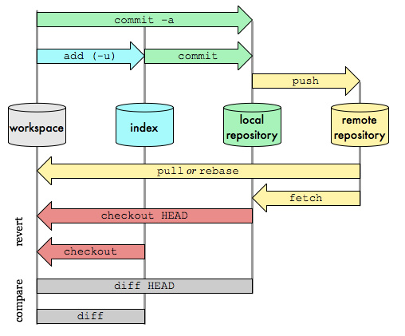

1. git add 路径/文件名   #添加到暂存区
2. git commit -m "修改说明"
3. git log查看提交日志及commit号
4. git reset --hard   #撤销修改至最后一次commit版本，把其他无需commit的撤销
5. git checkout 分支名
6. git pull    #切换到新分支后要先pull以保证本地分支是最新的
7. git cherry-pick commit号  #将之前分支上commit的内容应用到当前分支
8. git log 查看当前分支上是否有commit的内容
9. git diff HEAD^    #和修改之前内容做对比

* clone 特定分支

  ```
  git clone -b 分支号 hook地址
  ```
  
* git回退到特定commit号

  ```
  git reset --hard  commit号
  ```

* git切换到指定远程分支

  ```
  git checkout -b 本地分支名 origin/远程分支名
  ```

* 解决git报错 no matching key exchange method found. Their offer: diffie-hellman-group1-sha1
  
   ```
   创建~/.ssh/config并加入如下命令：
   Host *
      KexAlgorithms +diffie-hellman-group1-sha1
  然后执行ssh-keygen -t rsa -b 4096
   
   然后将.ssh/目录下的公钥内容拷贝加到gerrit中
  ```

* 将修改提交到gerrit上评审

  ```
  git push origin 本地分支名:refs/for/远程分支名
  ```

* 只是修改了文件，***没有任何 git 操作***，直接一个命令就可回退：

```
$ git checkout -- aaa.txt # aaa.txt为文件名
```

* 修改了文件，并提交到***暂存区***（即编辑之后，gitadd但没有gitadd但没有 git commit -m ....）

```
$ git log --oneline    # 可以省略
$ git reset HEAD    # 回退到当前版本
$ git checkout -- aaa.txt    # aaa.txt为文件名
```

* 修改了文件，并提交到***仓库区***（即编辑之后，gitadd和gitadd和 git commit -m ....）

```
$ git log --oneline    # 可以省略
$ git reset HEAD^    # 回退到上一个版本
$ git checkout -- aaa.txt    # aaa.txt为文件名
```

* 查看是否在远程分支上push了commit id

  ```
  git branch -r --contains commitId
  ```

* 查看git配置信息

  ```
  //查看仓库级的 config，命令：
  git config –-local -l
  //查看全局级的 config，命令：
  git config –-global -l
  //查看系统级的 config，命令：
  git config –-system -l
  //查看当前生效的配置，  命令：
  git config -l
  ```

* 基于某个分支创建新的分支，并推送到远端

  ```
  git checkout -b {new branch} origin/{base branch}
  git push origin {new branch}
  
  或git checkout -b {new branch} origin/{base branch}
  git push origin {new brach}：{remote branch}
  ```

* git log显示改动的文件列表

  ```
  git log --name-only			
  git log --name-status	#在only的基础上同时显示文件是改动的类型，例如是删除还是modify
  git log -stat			#在only的基础上显示改动的统计
  ```

* ```
  git diff/git diff {文件名} #是对比工作区与暂存区（index）的区别
  git diff HEAD/git diff HEAD {文件名} #是对比工作区与本地仓库最新版本的区别
  git diff HEAD~1/git diff HEAD~1 {文件名}	#是对比工作区与本地仓库最新版本的上一版本的区别
  git diff --cached/git diff --cached {文件名}	#对比暂存区与本地仓库最新版本的区别
  查看diff时白色代表双方都有的内容，绿色代表本工作区有但暂存区/本地仓库/其他没有的内容，红色代表本工作区没有但暂存区/本地仓库/其他有的内容
  单纯的git checkout后不跟参数，只是检查工作区状态，不进行操作
  ```

* ```
   git checkout experiment
   git rebase master
   原理是回到两个分支最近的共同祖先，根据当前分支（也就是要进行衍合的分支 `experiment`）后续的历次提交对象（C3），生成一系列文件补丁，然后以基底分支（也就是主干分支 `master`）最后一个提交对象（C4）为新的出发点，逐个应用之前准备好的补丁文件，最后会生成一个新的合并提交对象（C3'），从而改写 `experiment` 的提交历史，使它成为 `master` 分支的直接下游，最终结果都应用在当前（experiment）分支。此时当前分支比基地（master）分支ahead几个版本，可直接切换到master分支，然后git merge experiment把experiment合并到master分支，此时master分支和experiment分支一样。
  ```
  
  # Git 不同目录下不同的参数配置
  
  ## 配置加载顺序
  
  操作 `Git` 时，首先会加载系统级别的 `/etc/gitconfig` 文件（默认未创建可使用git config --system --list查看），之后是加载用户的全局配置文件 `~/.gitconfig`（git config --global --list查看），最后是针对每个仓库的 `.git/config` (git config --local --list查看)文件。如果加载过程中出现配置冲突时，后面的配置项会覆盖前面的配置。
  
  ## 方法
  
  我们可以使用 `includeif` 参数来实现不同目录不同配置的需求，首先打开 `~/.gitconfig` 文件，删除原有的 `[user]` 配置，并添加以下配置：
  
  
  
  ```csharp
  [includeIf "gitdir:**/workdir/**"]
      path = ~/.gitconfig_work
  [includeIf "gitdir/i:**/github/**"]
      path = ~/.gitconfig_github
  ```
  
  [详细配置说明](https://links.jianshu.com/go?to=https%3A%2F%2Fgit-scm.com%2Fdocs%2Fgit-config%23_conditional_includes)
  
  创建 `~/.gitconfig_work` 和 `~/.gitconfig_github` 文件，根据自身情况做配置，参考如下：
  
  ```csharp
  $ vim ~/.gitconfig_work
  [user]
      name = xxx
      email = xxx@company.com
  
  $ vim ~/.gitconfig_github
  [user]
      name = xxx
      email = xxx@gmail.com
  ```
  
  ## 只配置当前仓库配置信息
  
  在./.git/config文件中加入如下配置：
  
  ```
  [user]
  	name = wangyaxun
  	email = wangyaxun@email.com
  ```

  再次git config --local --list即可看到，以后使用git push时，作者信息就是wangyaxun
  
* config文件中添加push.default

  ```
  push.default=simple		#git push时只push当前分支到
  push.default=matching	#git push时推送本地仓库和远程仓库所有名字相同的分支
  ```

* 本地分支与远程分支关联

  ```
  git branch (--set-upstream-to=<upstream> | -u <upstream>) [<branchname>]例如：upstream为origin/{branch_name}
  git branch --unset-upstream [<branchname>]
  ```

* 修改HEAD处commit 提交信息

  ```
  git commit --amend		#进入vim后修改提交信息即可
  ```

* git reset和git checkout区别

   ```
   git reset 会移动HEAD及HEAD所指向的分支的指向
   git checkout 只会移动HEAD的指向，他所指向的分支的指向不会改变
   ```

* 强制移动分支到某个提交版本

  ```
  git branch -f {分支名} HEAD~1/{COMMIT_ID}
  ```

* amend

   ```
   git commit --amend命令用来修复最近一次commit. 可以让你合并你缓存区的修改和上一次commit, 而不是提交一个新的快照. 还可以用来编辑上一次的commit描述.
   ```

* 常用git stash命令：

  ```
  stash能够将所有未提交的修改（工作区和暂存区）保存至堆栈中，用于后续恢复当前工作目录。
  （1）git stash save "save message"  : 执行存储时，添加备注，方便查找，只有git stash 也要可以的，但查找时不方便识别。
  
  （2）git stash list  ：查看stash了哪些存储
  
  （3）git stash show ：显示做了哪些改动，默认show第一个存储,如果要显示其他存贮，后面加stash@{$num}，比如第二个 git stash show stash@{1}
  
  （4）git stash show -p : 显示第一个存储的改动，如果想显示其他存存储，命令：git stash show  stash@{$num}  -p ，比如第二个：git stash show  stash@{1}  -p
  
  （5）git stash apply :应用某个存储,但不会把存储从存储列表中删除，默认使用第一个存储,即stash@{0}，如果要使用其他个，git stash apply stash@{$num} ， 比如第二个：git stash apply stash@{1} 
  
  （6）git stash pop ：命令恢复之前缓存的工作目录，将缓存堆栈中的对应stash删除，并将对应修改应用到当前的工作目录下,默认为第一个stash,即stash@{0}，如果要应用并删除其他stash，命令：git stash pop stash@{$num} ，比如应用并删除第二个：git stash pop stash@{1}
  
  （7）git stash drop stash@{$num} ：丢弃stash@{$num}存储，从列表中删除这个存储
  
  （8）git stash clear ：删除所有缓存的stash
  ```

* git diff时出现^M

  ```
  git config --global core.autocrlf true 然，据说这是将crlf转换为lf
  ```

  

